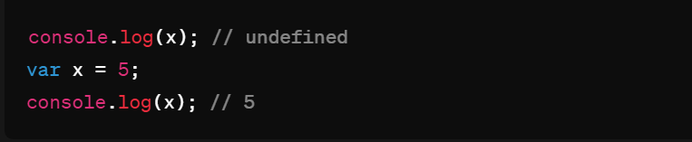
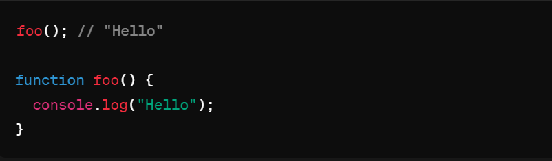

## Hoisting

> What is hoisting in javascript

Hoisting in JavaScript is a behavior where variable and function declarations are moved to the top of their containing scope during the compilation phase, before the code is executed. This means that regardless of where variables and functions are declared within a scope, they are effectively "hoisted" to the top of their scope.

In the above code, x is declared and assigned a value after the console.log() statement, but due to hoisting, the declaration of x is moved to the top of the scope, so the code behaves as if it were written like this:

In this example, even though the function foo() is called before its declaration, it still works because the function declaration is hoisted to the top of the scope. However, function expressions (where a function is assigned to a variable) are not hoisted in the same way.

> what is the uses of hoisting jn javascript

- **Flexibility in Coding**: Hoisting allows developers to write code in a more natural flow, without worrying about the order of function and variable declarations within a scope. This can make the code easier to read and understand.

- **Function Declaration Before Use**: Developers can declare functions anywhere in their code, even after they are used, which can be helpful for organizing code logically or structuring larger projects.

- **Avoiding Reference Errors**: While variables initialized with var are hoisted and initialized with undefined, functions are hoisted entirely. This means you can reference functions before they are declared without causing reference errors.

- **Understanding Scope Behavior**: Understanding hoisting helps developers better understand how JavaScript scopes work, which can lead to more efficient and bug-free code.